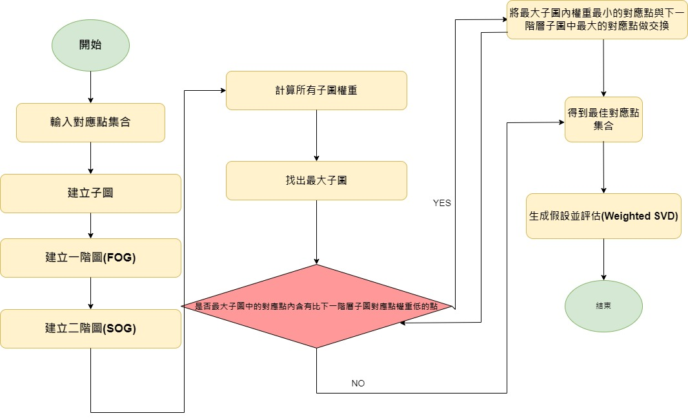

## Introduction  
We utilize a previously proposed graph-theoretical framework algorithm to identify the cliques with the maximum weights within the graph. The point-to-point weights within this cliques are then sorted, and better corresponding points from other cliques are exchanged to enhance the accuracy of registration. This method leverages the structured nature of the graph to improve the precision of point cloud alignment effectively.

## Repository layout  
The repository contains a set of subfolders:  
[`Linux`]([https://github.com/zhangxy0517/3D-Registration-with-Maximal-Cliques/tree/main/Linux](https://github.com/jeff0908/jeff0908-An-Maximum-Clique-Based-Registration-for-Point-Clouds/tree/main/Linux)) - source code for Linux platform.  

## Build
Details can be referred to [3D-Registration-with-Maximal-Cliques](https://github.com/zhangxy0517/3D-Registration-with-Maximal-Cliques)

MAC depends on [PCL](https://github.com/PointCloudLibrary/pcl/tags) (`>= 1.10.1`, version `1.10.1` is recommended) and [igraph](https://github.com/igraph/igraph/tags)(`=0.9.9`). Please install these libraries first.

To build MAC, you need [CMake](https://cmake.org/download/) (`>= 3.23`) and, of course, a compiler that supports `>= C++11`. The code in this repository has been tested on Windows (MSVC `=2022` `x64`), and Linux (GCC `=10.4.0`). Machines nowadays typically provide higher [support](https://en.cppreference.com/w/cpp/compiler_support), so you should be able to build MAC on almost all platforms.

### Linux version
Please refer to [Compiling on Linux](https://github.com/zhangxy0517/3D-Registration-with-Maximal-Cliques/blob/main/Linux/readme.md) for details.

## Usage:
* `--help` list all usages.
* `--demo` run the demo.
### Required args:
* `--output_path` output path for saving results. 
* `--input_path` input data path. 
* `--dataset_name`[3dmatch/3dlomatch/KITTI/ETH/U3M] dataset name.
* `--descriptor`[fpfh/fcgf/spinnet/predator] descriptor name. 
* `--start_index`(begin from 0) run from given index. 
### Optional args:
* `--no_logs` forbid generation of log files.

## Datasets
All tested datasets can be found at this [3D-Registration-with-Maximal-Cliques](https://github.com/zhangxy0517/3D-Registration-with-Maximal-Cliques)

## Results

### 3DMatch  

|    Benchmark   | RR(%) | RE(°) |TE(cm) |
|:---------------|:-----:|:-----:|:-----:|
|  3DMatch+FPFH+OURS  | 83.54 | 2.08  | 6.69  |
|  3DMatch+FCGF+OURS  | 93.46 | 2.01  | 6.49  |

### 3DLoMatch

|    Benchmark   | RR(%) | RE(°) |TE(cm) |
|:---------------|:-----:|:-----:|:-----:|
|  3DLoMatch+FPFH+OURS  | 41.5 | 4.02  | 10.49  |
|  3DLoMatch+FCGF+OURS  | 60.48 | 3.77  | 10.76  |

### KITTI

|    Benchmark   | RR(%) | RE(°) |TE(cm) |
|:---------------|:-----:|:-----:|:-----:|
|  FPFH+MAC  | 98.01 | 0.38  | 8.17  |
|  FCGF+MAC  | 97.48 | 0.35  | 7.95  |
